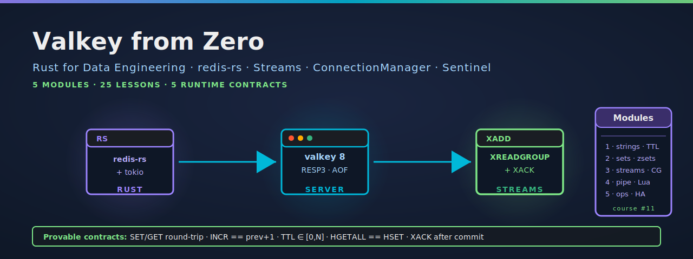

<p align="center">
  
</p>

[](https://github.com/paiml/valkey-from-zero/actions/workflows/ci.yml)
[](#license)
[](rust-toolchain.toml)
[](Makefile)
[](contracts/)
[](compose.yml)

# Valkey From Zero — Companion Repo

The runnable companion to the Coursera course **Valkey from Zero** (course #11 of
the *Rust for Data Engineering* specialization). Five modules covering caching,
sorted-set leaderboards, streams + consumer groups, pipelining + Lua, and
operational HA — all built against Valkey 8 from async Rust via `redis-rs`.

> **Why Valkey, not Redis** — Redis Inc. relicensed Redis 7.4+ under SSPL/RSALv2
> in March 2024. The Linux Foundation forked the last permissive version as
> **Valkey** (Apache-2.0). The `redis` crate on crates.io is wire-compatible
> with both forks, so the Rust client code is identical. Lesson 1.1 acknowledges
> the lineage explicitly so students searching for "Redis" find the content.

## Quick start

    git clone https://github.com/paiml/valkey-from-zero
    cd valkey-from-zero
    make up          # docker compose up -d (Valkey 8 on 127.0.0.1:6379)
    make demo        # cargo run --bin valkey-demo — four runtime contracts
    make test        # cargo test --release (lib unit + integration)

`make up` is idempotent. The container has AOF persistence enabled and a
256 MB LRU eviction cap so the cache lessons (Module 1) and persistence
lessons (Module 5.1) have something observable.

## Installation

One-line install per prerequisite:

    curl -fsSL https://get.docker.com | sh           # Docker 24+ for compose.yml
    curl -sSf https://sh.rustup.rs | sh              # rustup; rust-toolchain.toml pins 1.95

## Usage

    make up          # start Valkey 8
    make demo        # run all four contracts against the live instance
    make test        # cargo test --release (4 lib unit + 4 integration tests)
    make lint        # cargo clippy --all-targets -- -D warnings
    make coverage    # cargo llvm-cov line coverage report
    make pmat        # pmat quality-gate (entropy excluded — small-repo artifact)
    make down        # docker compose down (keeps the named volume)
    make nuke        # docker compose down -v (wipes the AOF data)

The demo binary takes flags via env:

    VALKEY_URL=redis://host:6379 cargo run --bin valkey-demo

## What's in this repo (today)

```
valkey-from-zero/
├── compose.yml                     # Valkey 8 single-node, AOF on, 256MB LRU cap
├── crates/
│   └── valkey-core/                # connection helper + four named contracts
│       ├── src/lib.rs              # set_get_round_trip / incr_monotonic / set_with_ttl / hash_round_trip
│       ├── src/main.rs             # valkey-demo binary
│       └── tests/integration.rs    # round-trips against the running container
├── contracts/
│   └── valkey-rust-v1.yaml         # provable contracts; lintable via `pv lint contracts/`
├── assets/
│   └── hero.svg                    # README banner
└── .github/workflows/ci.yml        # gate-matrix (1.95 + stable) + Valkey service
```

The Module-3 streams crate (`crates/valkey-streams`) and course-capstone CLI
(`crates/valkey-cli`) are scaffolded into the workspace plan but their content
lands with the lesson scripts. The single-container `compose.yml` is enough for
Modules 1–4; Module 5's Sentinel + Cluster topology will arrive as
`compose.cluster.yml` alongside Module 5 lessons.

## Provable contracts

Four named runtime contracts asserted inside the `valkey-core` demo functions,
formalised in [`contracts/valkey-rust-v1.yaml`](contracts/valkey-rust-v1.yaml):

| ID | Rule | Where asserted |
|----|------|----------------|
| C1 | `GET(SET(k, v)) == v` | `set_get_round_trip()` |
| C2 | `INCR(k) == GET_or_zero(k) + 1` | `incr_monotonic()` |
| C3 | `0 ≤ TTL(k) ≤ ttl after SET k v EX ttl` | `set_with_ttl()` |
| C4 | `HGETALL(HSET(k, fields)) == fields` | `hash_round_trip()` |

Each contract has a falsification ID (`FALSIFY-VALKEY-001..004`), an
enforcement description, and a Kani harness placeholder in the YAML. A fifth
contract — *XACK after Postgres commit* — is reserved for the Module-3
streams expansion.

## Quality status

| Metric | Result |
|--------|--------|
| Tests | **8 passing** (4 lib unit + 4 integration) |
| `cargo clippy --all-targets -- -D warnings` | clean |
| `pv lint contracts/` | **PASS** (0 errors, 4 advisory warnings) |
| `pmat comply` | exit 0 |
| Demo against live Valkey 8 | all four contracts assert cleanly |

Reproduce: `make up && make demo && make test && make lint`.

## Course outline (preview)

Five modules; the companion repo's `valkey-core` crate underlies Module 1 and
will grow as the lessons land:

| Module | Title | Status |
|--------|-------|--------|
| 1 | Strings, hashes & key namespaces | scaffolded (`valkey-core`) |
| 2 | Lists, sets, sorted sets & leaderboards | planned |
| 3 | Streams, consumer groups & XREADGROUP | planned (`valkey-streams`) |
| 4 | Pipelines, transactions & Lua scripts | planned |
| 5 | Operations: persistence, replication & Sentinel | planned (`compose.cluster.yml`) |

The course-level capstone is a real-time inventory service that uses every
layer: session hashes (M1), trending-products leaderboard (M2), order-pipeline
streams (M3), Lua-scripted atomic stock decrement (M4), running against the
Sentinel cluster (M5).

## Contributing

PRs that improve fidelity to the course videos, fix data-fetch breakage, or
harden the provable contracts are welcome. Before opening a PR:

1. `make test && make lint` must pass cleanly
2. Coverage gate is `cargo llvm-cov --release --workspace` ≥ 95% on `lib.rs`
3. `pv lint contracts/` must remain at 0 errors
4. Any new contract goes in both `contracts/valkey-rust-v1.yaml` and a runtime
   `assert!` inside the corresponding demo function

## License

Dual-licensed under MIT or Apache-2.0 at your option (matches the rest of the
PAIML Coursera companion repos). See `LICENSE-MIT` and `LICENSE-APACHE`.
